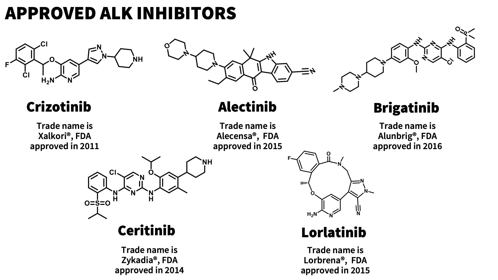
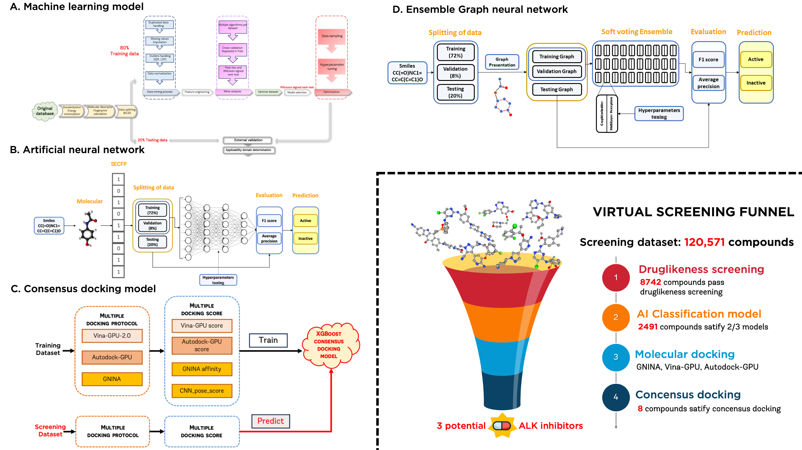
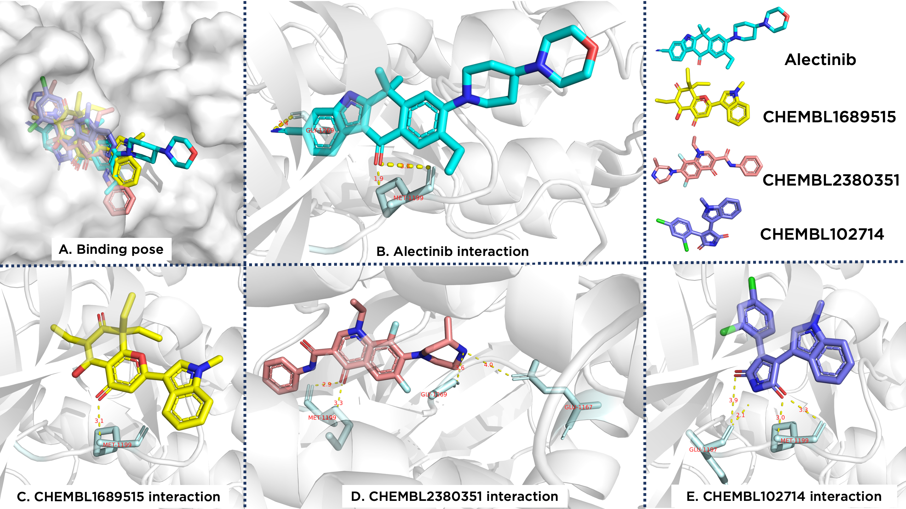

# DEVELOPMENT AND INTEGRATION OF ADVANCED MACHINE LEARNING, ANN, GNN IN CONJUNCTION WITH MOLECULAR DOCKING TECHNIQUES FOR THE PREDICTION OF POTENT ANAPLASTIC LYMPHOMA KINASE INHIBITORS

## Introduction

Non-Small Cell Lung Cancer (NSCLC) is a prevalent form of lung cancer, with the ALK-positive mutation variant accounting for 5% of total cases1. While ALK inhibitors have shown efficacy in inhibiting cancer cell growth, only five have received FDA approval, indicating a significant need for new drugs. This project leverages artificial intelligence (AI) and machine learning to accelerate the identification and discovery of promising ALK inhibitor candidates.

## Materials and Methodology

### Raw Data
The raw dataset includes 26,168 substances tested for their ALK receptor inhibitory potential collected from scientific articles. The ALK protein (PDB ID: 3AOX) is used for building classification models and conducting molecular docking.

### Screening Process
A set of substances investigated for activity on A549 cells (ChEMBL33 database, identifier ChEMBL392)2 is screened through constructed models, including the ADMET filter, machine learning model (XGBoost), Artificial neural network (ANN), Ensemble Graph neural network (E-GNN)3, and consensus molecular docking models.

## Results and Discussions

The study successfully utilized 1,664 substances to construct and evaluate ALK inhibitor classification models:

1. **XGBoost Machine Learning Model:**
   - External Validation (EV) - F1 Score = 0.921, AP = 0.961
   - Cross-Validation (CV) - F1 Score = 0.888±0.039, AP = 0.939±0.032

2. **ANN Model:**
   - EV - F1 Score = 0.890, AP = 0.924
   - CV - F1 Score = 0.892±0.037, AP = 0.937±0.043

3. **E-GNN Model:**
   - EV - F1 Score = 0.808±0.009, AP = 0.827±0.041
   - CV - F1 Score = 0.804±0.049, AP = 0.879±0.041

A consensus docking model integrated results from Autodock-GPU, Vina-GPU-2.0, and GNINA software, achieving an AUC of 0.818. The project virtually screened 120,571 substances and identified the three most promising ALK inhibitors: CHEMBL1689515, CHEMBL2380351, and CHEMBL102714.

## Conclusions

The study recommends:
- Carrying out molecular dynamic simulations for the three potential substances.
- Conducting in vitro tests to validate findings.
- Enhancing the performance of the GNN model by augmenting data and exploring new network structures.
- Exploring other AI models such as CNN and RNN to optimize the drug design process.

## References
1. Roskoski, R., Jr., "Anaplastic Lymphoma Kinase (ALK): Structure, Oncogenic Activation, and Pharmacological Inhibition," *Pharmacol Res*, vol. 68, pp. 68-94, 2013, [DOI: 10.1016/j.phrs.2012.11.007](https://doi.org/10.1016/j.phrs.2012.11.007).
2. Gaulton, A. et al., "ChEMBL: A Large-Scale Bioactivity Database for Drug Discovery," *Nucleic Acids Res*, vol. 40, pp. D1100-D1107, 2011, [DOI: 10.1093/nar/gkr777](https://doi.org/10.1093/nar/gkr777).
3. T.-C. Trinh et al., "Graph Neural Network Model for Accurate Prediction of Anaplastic Lymphoma Kinase Inhibitors," *15th Int. Conf. on Knowledge and Systems Engineering (KSE)*, Hanoi, Vietnam, 2023, pp. 1-6, [DOI: 10.1109/KSE59128.2023.10299477](https://doi.org/10.1109/KSE59128.2023.10299477)

## Contributors

- [The-Chuong TRINH](https://github.com/trinhthechuong)
- [Tieu-Long PHAN](https://github.com/TieuLongPhan)
- [Van-Thinh TO](https://github.com/ThinhUMP)
- [Thanh-An PHAM](https://github.com/Thanh-An-Pham)
- Hoang-Son LE-LAI
- [Gia-Bao TRUONG](https://github.com/buchijw)
- [Ngoc-Tuyen TRUONG](http://uphcm.edu.vn/emplinfo.aspx?EmplCode=truongngoctuyen)
